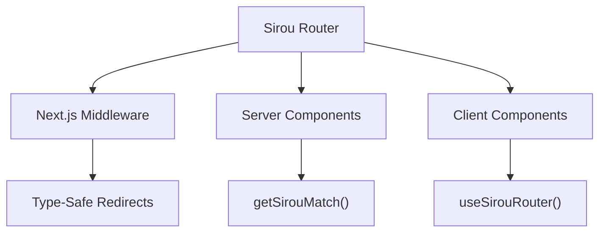

# Next.js Adapter

Seamlessly bridge Sirou's centralized routing with Next.js App Router and Server Components.

## Integration Architecture



## Installation

```bash
npm install @sirou/nextjs
```

## Features

:::features

### Server Actions

Use `sirouRedirect` inside your Server Actions for type-safe, validated redirects.

### Edge Middleware

Run Sirou guards directly at the edge to handle authentication and feature flags before the request hits your server.

### Shared Logic

Share 100% of your routing schema between your Next.js web app and your React Native mobile app.
:::

## Server Component Usage

Access route information directly on the server without any client hydration.

```typescript
// app/user/[id]/page.tsx
import { getSirouMatch } from '@sirou/nextjs/server';
import { routes } from '@/lib/routes';

export default async function Page({ params }) {
  const match = getSirouMatch(routes, '/user/' + params.id);

  return (
    <div>
      <h1>{match.meta.title}</h1>
      <p>Param ID: {match.params.id}</p>
    </div>
  );
}
```

## Using Guards in Middleware

Protect your Next.js routes using the same guard logic you use on the client.

```typescript
// middleware.ts
import { sirouMiddleware } from "@sirou/nextjs/middleware";
import { routes } from "./lib/routes";

export default sirouMiddleware(routes, {
  guards: ["auth", "isAdmin"],
});

export const config = {
  matcher: ["/admin/:path*", "/dashboard/:path*"],
};
```

---

Next: Moving to mobile with [React Native](react-native.md).
