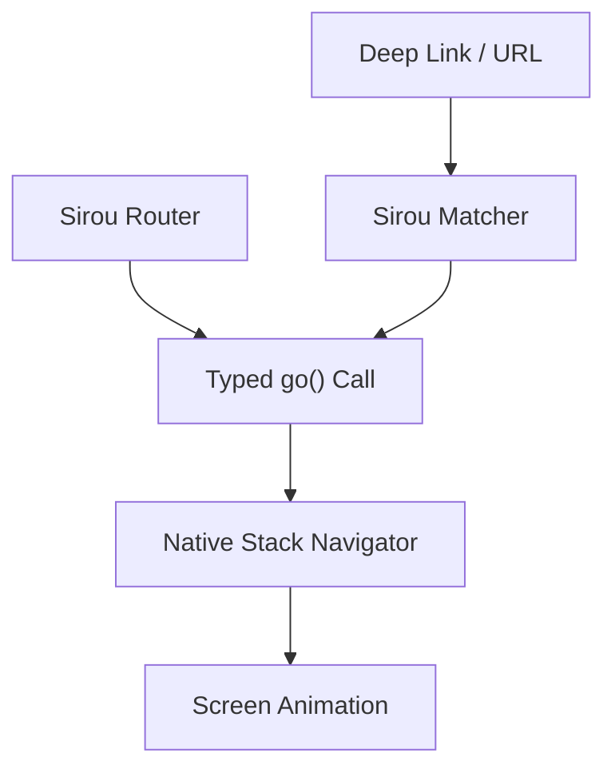

# React Native Adapter

Typed navigation for mobile apps. Sirou for React Native provides a full bridge to React Navigation, keeping your business logic universal while using native mobile primitives.

## Mobile Navigation Flow



## Installation

```bash
npm install @sirou/react-native
```

## Key Features

:::features

### Native Performance

Leverages the high-performance Sirou Trie for lightning-fast route matching on mobile devices.

### React Navigation Bridge

Sync Sirou's route state with React Navigation's history stack for a seamless native feel.

### Deep Linking

Automatic support for mobile deep links, mapped directly from your centralized schema.
:::

## Basic Setup

```tsx
import { SirouNativeProvider, createNativeRouter } from "@sirou/react-native";
import { routes } from "./routes";

const router = createNativeRouter(routes);

export function App() {
  return (
    <SirouNativeProvider router={router}>
      <NavigationContainerContainer>
        {/* Your Native Stack */}
      </NavigationContainerContainer>
    </SirouNativeProvider>
  );
}
```

## Typed Hook Usage

```tsx
import { useRouteParams } from "@sirou/react-native";

function DetailsScreen() {
  // Params are fully typed based on your routes.ts schema
  const { userId } = useRouteParams("user_detail");

  return <Text>Viewing User: {userId}</Text>;
}
```

---

Next: Reactive routing with [Svelte](svelte.md).
