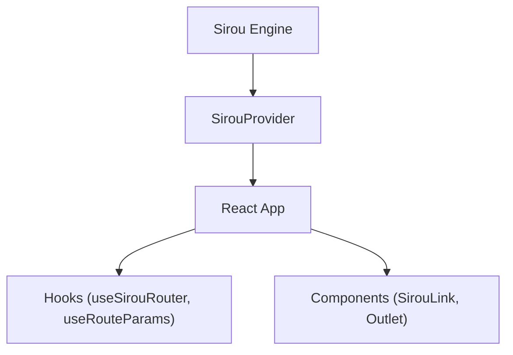

# React Adapter

The Sirou React adapter provides a collection of hooks and components to bind the core routing engine to your React application.

## Overview



## Installation

```bash
npm install @sirou/react
```

## Core Components

### `SirouProvider`

Wraps your application and provides the router context.

```tsx
import { SirouProvider, createBrowserRouter } from "@sirou/react";
import { routes } from "./routes";

const router = createBrowserRouter(routes);

function Root() {
  return (
    <SirouProvider router={router}>
      <App />
    </SirouProvider>
  );
}
```

### `SirouLink`

A type safe link component that ensures you never point to a non existent route.

```tsx
import { SirouLink } from "@sirou/react";

<SirouLink to="profile" params={{ id: "42" }}>
  View Profile
</SirouLink>;
```

## Typed Hooks

:::features

### `useSirouRouter()`

Access the router instance for programmatic navigation: `router.go('home')`.

### `useRouteParams(routeName)`

Get fully typed parameters for a specific route.

### `useRouteData(routeName)`

Access data fetched by the route's loaders.
:::

---

Next: Moving to the server with [Next.js](nextjs.md).
