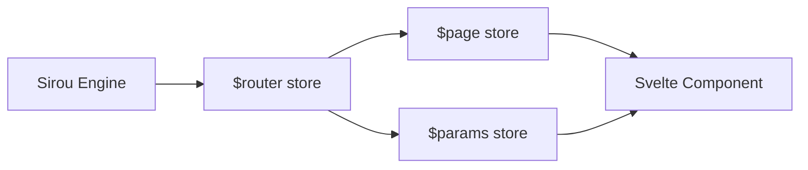

# Svelte Adapter

Reactive, type safe routing for the Svelte ecosystem. Sirou for Svelte brings the power of centralized schema management to Svelte and SvelteKit applications.

## Reactive Architecture



## Installation

```bash
npm install @sirou/svelte
```

## Key Features

:::features

### First-Class Stores

Route state, parameters, and query strings are exposed as native Svelte stores for effortless reactivity.

### SvelteKit Ready

Augment SvelteKit's file based routing with Sirou's centralized type safety and crossplatform guards.

### Minimal Boilerplate

Leverage Svelte's concise syntax with our custom providers and components.
:::

## Setup (SvelteKit)

```svelte
<!-- src/routes/+layout.svelte -->
<script>
  import { SirouProvider, createSvelteRouter } from '@sirou/svelte';
  import { routes } from '$lib/routes';

  const router = createSvelteRouter(routes);
</script>

<SirouProvider {router}>
  <slot />
</SirouProvider>
```

## Using Stores

```svelte
<script>
  import { params, page } from '@sirou/svelte';

  // Fully typed and reactive
  $: id = $params.id;
  $: title = $page.meta.title;
</script>

<h1>{title}</h1>
<p>User ID: {id}</p>
```

---

Check the [Changelog](../changelog.md) for the latest updates.
