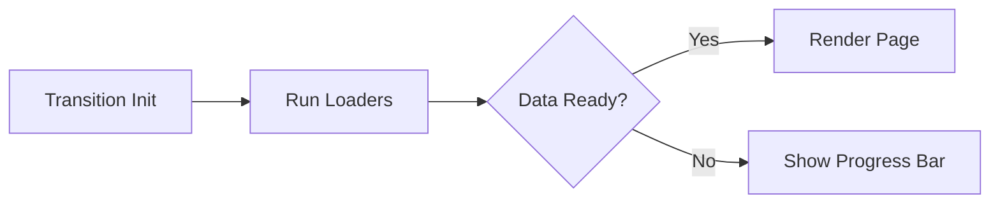

# Data Loaders

Data Loaders allow you to fetch the data your screens need **before** the transition occurs. This eliminates UI watermarks and ensure a premium, flicker free experience.

## The Loading Pattern



## Define a Loader

Loaders are defined directly in your route schema.

```typescript
export const routes = defineRoutes({
  userProfile: {
    path: "/user/:id",
    loaders: {
      user: async ({ id }) => {
        return fetchUser(id);
      },
      posts: async ({ id }) => {
        return fetchUserPosts(id);
      },
    },
  },
});
```

## Accessing Data

Use the `useRouteData` hook to access the pre loaded data in your components.

```tsx
import { useRouteData } from "@sirou/react";

function ProfilePage() {
  const { user, posts } = useRouteData("userProfile");

  return (
    <div>
      <h1>{user.name}</h1>
      <PostList items={posts} />
    </div>
  );
}
```

## Key Advantages

:::features

### No UI Waterfall

Parallelize data fetching so the screen only renders once the entire data tree is ready.

### Type Safety

Data returned from loaders is automatically typed when accessed via hooks.

### Cache Awareness

Sirou intelligently manages loader state, preventing redundant fetches during param only updates.
:::

---

Next: See how Sirou integrates with [React / Next.js](../adapters/react.md).
