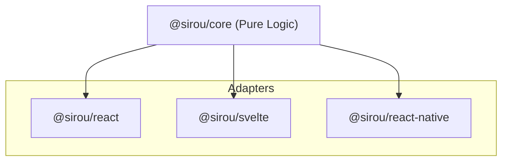

# Headless Engine

Sirou's core engine is 100% "Headless"—meaning it is a pure logic layer with no dependencies on a DOM, a framework, or even a browser environment.

## Logic-First Architecture

The `@sirou/core` package provides the "Brain" of your routing system. Adapters for React, Svelte, or React Native are merely thin wrappers that bind the engine's state to UI components.



## Benefits of Headless Routing

:::features

### Cross-Platform

Use the exact same `routes.ts` file in your Web Dashboard and your Expo Mobile App.

### Testable

Match routes, run guards, and verify redirects in Node.js or Vitest without needing to mount a UI.

### Framework Agnostic

Migrating from React to Svelte? Keep 100% of your routing logic and navigation flow.
:::

## Example: No-UI Usage

You can use Sirou to match paths or build URLs even in a CLI or a background worker.

```typescript
import { createMatcher } from "@sirou/core";
import { routes } from "./routes";

const matcher = createMatcher(routes);
const match = matcher.match("/user/42");

if (match) {
  console.log("Matched Route:", match.name); // "profile"
  console.log("Parsed ID:", match.params.id); // "42"
}
```

---

Next: Secure your routes with [Logic Guards](logic-guards.md).
