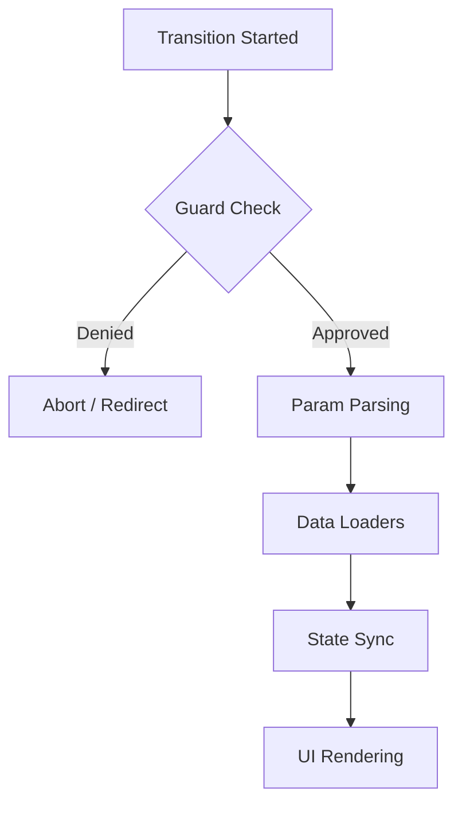

# Navigation Lifecycle

Every navigation in Sirou follows a strict, asynchronous lifecycle. This ensures that guards are resolved and data is loaded before the UI state updates.

## The Lifecycle Flow

## Lifecycle Stages

### 1. Guard Phase

The router executes all registered global and route-specific guards. If any guard returns a redirect or denies access, the transition is interrupted.

### 2. Loader Phase

Once access is granted, Sirou executes the `loaders` defined for the target route in parallel. This eliminates "waterfall" fetching inside components.

### 3. State Phase

After all asynchronous logic resolves, the router updates its internal state. This is the moment reactive stores ($page in Svelte, hooks in React) emit their new values.

## Key Features

:::features

### Concurrent Loading

Loaders run in parallel with the transition, ensuring the screen only changes when the data is ready.

### Graceful Abort

If a new navigation starts before the current one finishes, any pending loaders from the previous transition are automatically cancelled.

### Custom Errors

Hook into the `onError` lifecycle to handle failed guards or network errors globally.
:::

---

Next: Explore the [Headless Engine](headless-engine.md).
