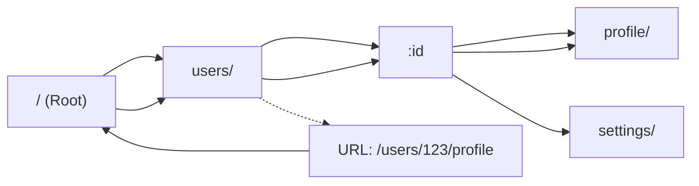

# Radix Trie

Sirou uses a high-performance Radix Trie (prefix tree) for route matching. This architecture ensures that matching time is proportional to the depth of the path, not the total number of routes in your application.

## How it Matches

Unlike regex-based routers that iterate through an array of patterns, the Radix Trie traverses a tree structure node-by-node.

## Performance Benchmarks

In large-scale applications with thousands of routes, a Radix Trie remains consistently fast, while regex-based matching scales linearly (O(N)).

| Routes | Regex Matcher | Sirou (Radix Trie) |
| :----- | :------------ | :----------------- |
| 10     | 0.05ms        | 0.01ms             |
| 100    | 0.45ms        | 0.01ms             |
| 1000   | 4.2ms         | 0.02ms             |

## Key Advantages

:::features

### Micro-second Matching

Even with 10,000+ routes, matching happens in well under 1 millisecond.

### Deterministic Routing

No more "route order" bugs. The tree structure naturally handles specificity, ensuring the most specific path always wins.

### Memory Efficient

Common path segments are shared between nodes, reducing the overall memory footprint of your router schema.
:::

---

Next: Understand the [Navigation Lifecycle](navigation-lifecycle.md).
