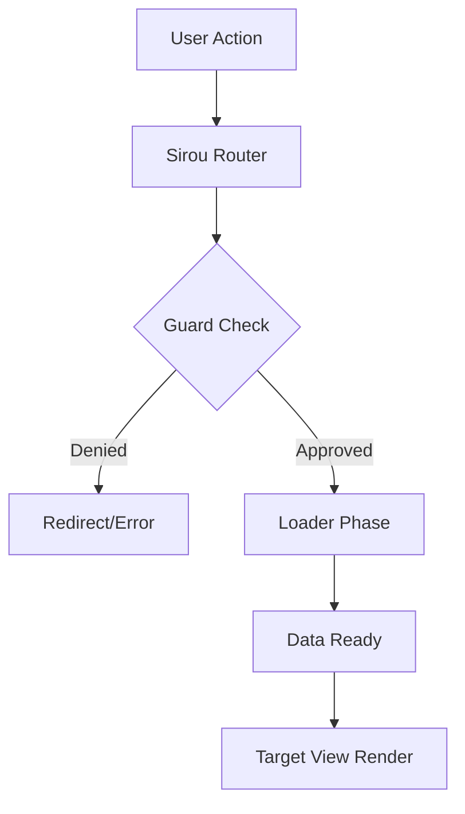
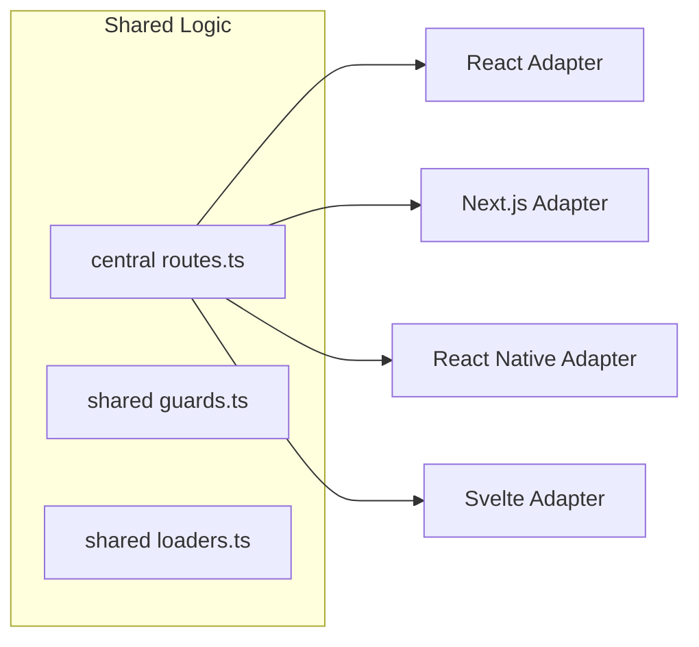

# Comparison

Sirou takes a different approach to routing. Instead of just "mapping a URL to a component", we treat the route as a **State Object** with a defined lifecycle.

## Sirou vs. React Router

React Router is the industry standard, but it often leads to "stringly typed" navigation and manual data fetching logic injected deep into components.

| Feature          | React Router                       | Sirou                                       |
| :--------------- | :--------------------------------- | :------------------------------------------ |
| **Type Safety**  | Primarily via third party wrappers | Built in from day one with zero config      |
| **Navigation**   | `navigate("/users/123")`           | `router.go("user_detail", { id: "123" })`   |
| **Guard Logic**  | Manual wrappers / `useEffect`      | Native `guards` property in schema          |
| **Data Flow**    | Loader functions (v6+)             | Integrated `loaders` with type safe context |
| **Architecture** | Component centric                  | Schema centric (Single Source of Truth)     |

## Sirou vs. Next.js (App Router)

Next.js is a powerful framework with file system routing, but Sirou offers more centralized control.

- **Centralized Schema**: Next.js defines routes by folder structure. Sirou defines routes in a single `routes.ts` file, making it easier to see the whole application map at a glance.
- **Param Parsing**: In Next.js, `params` are always strings in the server component. Sirou parses them according to your schema (numbers, booleans, customs) before they hit your logic.
- **Universal Flow**: Sirou routes can be shared between your Next.js web app and your React Native mobile app. Next.js routing is web only.

## Sirou vs. SvelteKit

SvelteKit uses a file-based router similar to Next.js.

- **Reactivity**: Sirou provides native Svelte stores (`$page`, `$params`) that are fully typed against your schema.
- **Guard Uniformity**: SvelteKit's `hooks.server.js` and `+page.server.js` handles security. Sirou allows you to use the same Guard logic in your Svelte web app and your React Native app.

## Sirou vs. React Native CLI (React Navigation)

React Navigation is the standard for React Native CLI, but it lacks a built in "Web to Mobile" uniformity.

- **Navigation Unified**: Use `go('profile', { id: 1 })` on Web and it maps to a `push('Profile', { id: 1 })` on Mobile automatically.
- **State Engine**: React Navigation stores state in its own complex object. Sirou stores route state in a lean, serializable object that integrates with your app's global state easily.

## Sirou vs. Expo Router

Expo Router brings file-system routing to native mobile, but Sirou provides more flexibility for complex enterprise apps.

- **Schema vs File System**: Like Next.js, Expo Router is file based. Sirou is schema based, allowing you to define complex guards and loaders without deep folder nesting.
- **Cross-Platform Sync**: Expo Router is excellent for Expo apps. Sirou is designed for teams that may have a Next.js web app and a React Native mobile app and want to share **100%** of their routing logic.

## Conceptual Overview

## Cross-Platform Flow

Choosing Sirou means choosing a predictable, typed, and structured way to handle how users move through your application across all platforms.
