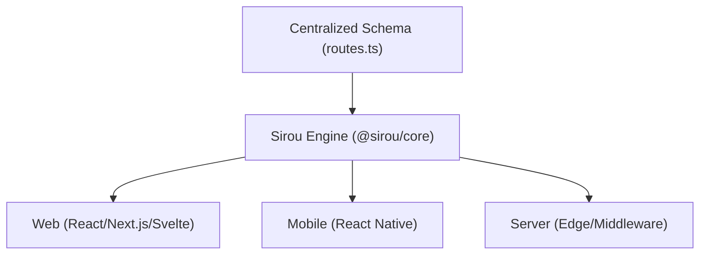

# Introduction

Sirou is a framework-agnostic, universal routing and navigation engine for TypeScript. It provides a single source of truth for your application's architecture, ensuring type safety and consistent logic across Web, Mobile, and Server environments.

## The Core Philosophy

Modern application development often leads to fragmented routing logic—different patterns for your Next.js web app, your React Native mobile app, and your server-side redirects. Sirou solves this by treating your routes as a **centralized schema**.



## Key Benefits

:::features

### Type Safety

Automatic autocomplete and validation for route names, parameters, and query strings. Catch broken links at compile-time.

### Headless Engine

The core logic is pure TypeScript. Zero dependencies on the DOM or any specific UI framework.

### Universal Bridge

Share 100% of your routing logic, guards, and loaders between your Web dashboard and Mobile app.
:::

## How it Works

1. **Define**: Create a type-safe schema using `defineRoutes`.
2. **Abstract**: Use symbols and types, not string paths, for navigation.
3. **Navigate**: Use framework-specific adapters to bind Sirou to your UI.

```typescript
import { defineRoutes } from "@sirou/core";

// Single source of truth
export const routes = defineRoutes({
  dashboard: {
    path: "/dashboard",
    meta: { title: "User Dashboard" },
  },
  profile: {
    path: "/user/:id",
    params: { id: "string" },
  },
});
```

---

Ready to start? Head over to the [Installation](getting-started/installation.md) guide.
