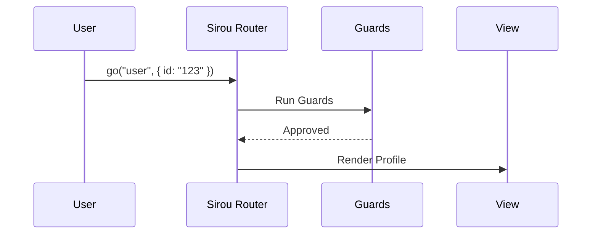

# Quick Start

Get your first type safe route running in less than 5 minutes.

## 1. Define Your Routes

Create a `routes.ts` file to serve as your single source of truth.

```typescript
// routes.ts
import { defineRoutes } from "@sirou/core";

export const routes = defineRoutes({
  home: { path: "/" },
  user: {
    path: "/user/:id",
    params: { id: "string" },
  },
});
```

## 2. Initialize the Router

In your main entry file, create the router instance and provide it to your app.

:::tabs
@tab React

```tsx
// App.tsx
import { SirouProvider, createBrowserRouter } from "@sirou/react";
import { routes } from "./routes";

const router = createBrowserRouter(routes);

export function App() {
  return (
    <SirouProvider router={router}>
      <YourAppContents />
    </SirouProvider>
  );
}
```

@tab Svelte

```svelte
<!-- +layout.svelte -->
<script>
  import { SirouProvider, createSvelteRouter } from '@sirou/svelte';
  import { routes } from './routes';

  const router = createSvelteRouter(routes);
</script>

<SirouProvider {router}>
  <slot />
</SirouProvider>
```

:::

## 3. Navigate with Type Safety

Forget string based paths. Use the route name and a typed params object.

```tsx
import { useSirouRouter } from "@sirou/react";

function Nav() {
  const router = useSirouRouter();

  return (
    <button onClick={() => router.go("user", { id: "123" })}>
      View Profile
    </button>
  );
}
```

## Navigation Flow



---

Learn more about the [Radix Trie](../core/radix-trie.md) matching engine.
